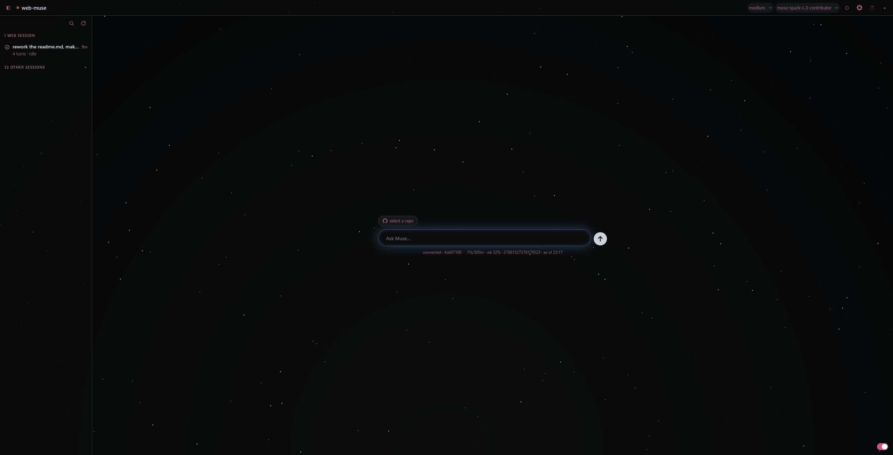
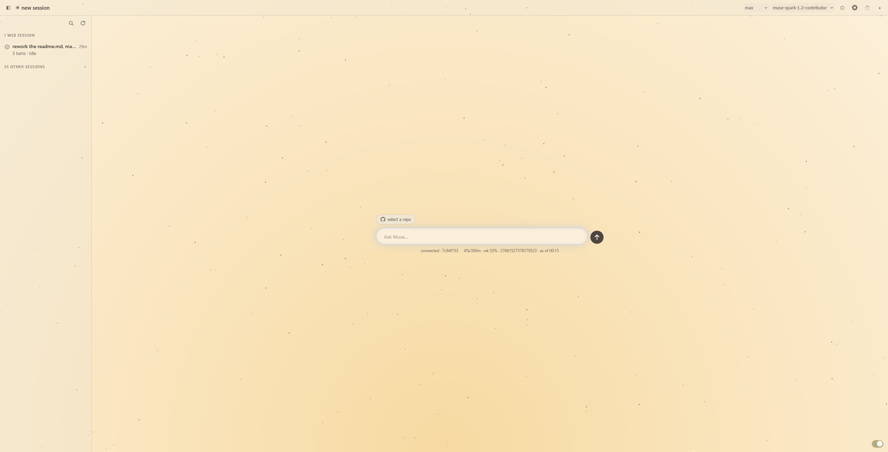
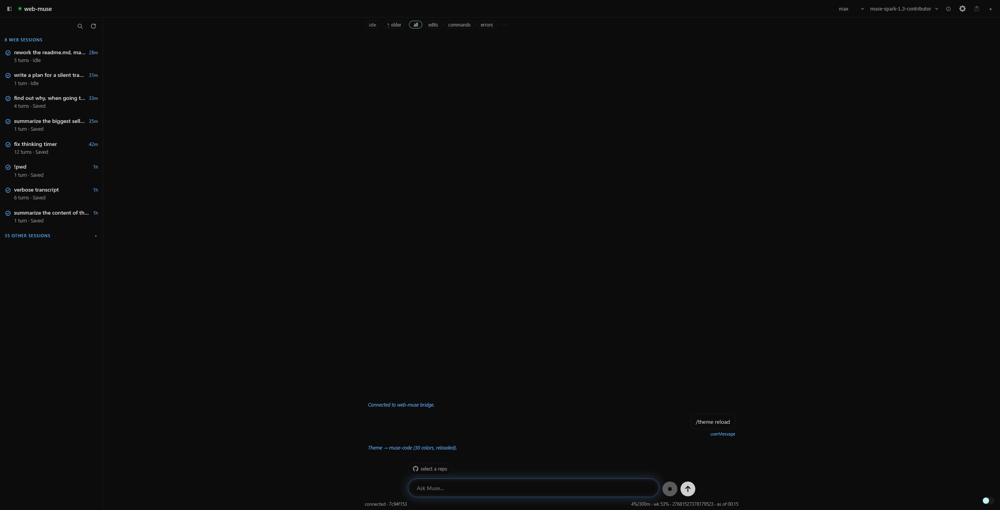
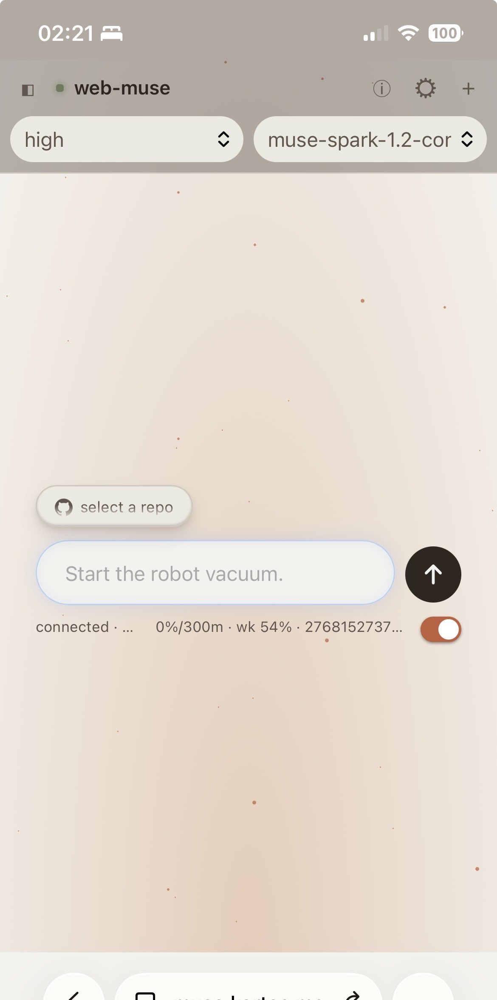
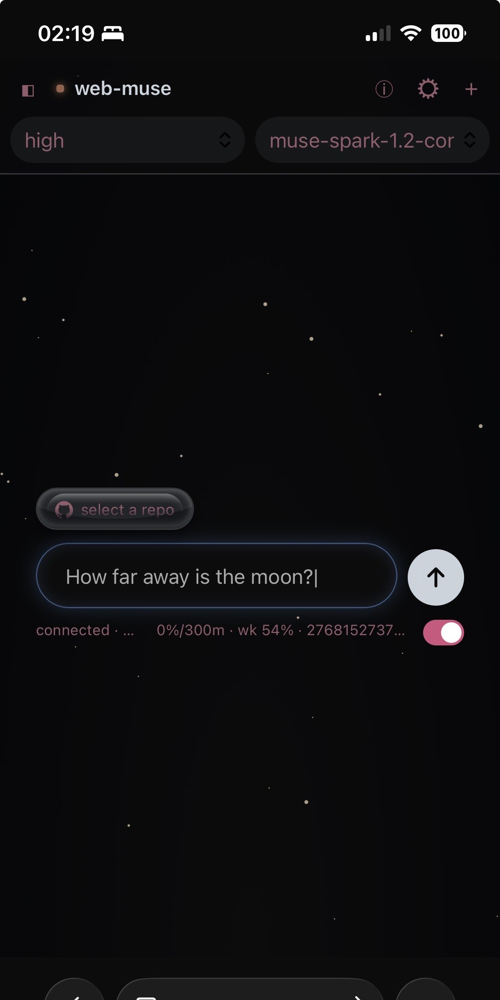

# web-muse

A browser UI for Muse, running on your own machine. `web-muse` is a small localhost bridge between a static web app and one persistent `muse serve` host process. Python stdlib only — no build step, no dependencies.

```
browser  ⇄  web-muse bridge (HTTP + WebSocket, 127.0.0.1:8000)  ⇄  muse serve (MSP v1 stdio)
```

Your existing `muse login` subscription passes straight through to the `muse serve` child. No API keys are accepted or stored anywhere in this project.

## Screenshots

Live demo mockup: [web-muse.kortec.me](https://web-muse.kortec.me)







<p>
  
  
</p>

## Features

- Chat UI with live streaming transcripts, session list, and inspector (approvals, input requests, models, usage)
- Per-session workspaces: every session gets its own directory for the agent's shell and file tools
- GitHub flow: list repos, shallow-clone, and open a repo in a session with one click (via the `gh` CLI you already auth)
- Slash commands with `Tab` completion (`/new`, `/resume`, `/model`, `/effort`, `/github …`, `/theme`, …)
- Approval cards with an explicit `allowAll` opt-in (warned in the UI), plus a narrow auto-approve policy for GitHub sessions
- Themable UI: drop a `<name>.json` palette into `web/themes/` and apply it with `/theme <name>`
- Status page at `/progress.html`: bridge/MSP liveness, version, uptime, and a live event ticker
- Works offline for smoke tests with `--provider echo`

## Requirements

- Python 3.9 or newer (stdlib only — no packages to install)
- The `muse` CLI, logged in (`muse login`), with `muse serve` speaking MSP v1 (schema version 1). Verified against Muse 1.4.2; other host versions log a schema-mismatch warning and continue, but the mapping may be stale — check `/progress.html` or the bridge log if the UI misbehaves after a `muse` upgrade.
- Optional: the `gh` CLI, authed (`gh auth login`) — only for the GitHub repos panel and `/github` commands
- Optional: systemd user services — only for the auto-start setup below

## Quick start

```sh
python3 -m server.main --port 8000
# open http://127.0.0.1:8000/
```

Useful flags:

```sh
python3 -m server.main --port 8000 --provider echo   # offline smoke test, no model calls
python3 -m server.main --provider meta --model <id>  # pick provider / model override
```

Full flag list: `--host` (loopback only: `127.0.0.1`, `::1`, or `localhost` — anything else is refused; the bridge always listens on both `127.0.0.1` and `::1`), `--port`, `--provider`, `--model`, `--muse-bin`, `--web-dir`, `--workspace-base`, `--trust-workspace / --no-trust-workspace`, `--no-session-log`, `--sandbox-network {restricted,enabled,proxy-only}`, `--allow-host` (repeatable), `-v`. Environment alternative for extra hosts: `WEB_MUSE_ALLOWED_HOSTS=a,b`.

## Run as a service

The bridge ships as a per-user systemd unit. It must run as you (never as root) so your `muse login` passes through to the `muse serve` child.

```sh
./deploy/install.sh
# open http://127.0.0.1:8000/
```

This copies [`deploy/web-muse.service`](deploy/web-muse.service) to `~/.config/systemd/user/` and enables it with `Restart=on-failure`.

```sh
systemctl --user status web-muse
journalctl --user -u web-muse -f
systemctl --user restart web-muse      # after server-side changes
systemctl --user disable --now web-muse  # stop + don't start at login
```

Notes:

- The unit assumes a checkout at `~/web-muse`, Python at `/usr/bin/python3`, and `muse` at `~/.local/bin/muse`. Override paths or add flags with `systemctl --user edit web-muse` (see the commented example at the top of the unit; clear `ExecStart=` first, then set the new line).
- Run `loginctl enable-linger` once (needs admin) to keep the service alive after you log out; without it, user services stop at logout.

## Usage

### Sessions

Each new session gets its own directory, `workspaces/<sessionId>/`, created before `session/start` and sent as `workspaceRoot` — this is what gives the agent shell and file tools. Variations:

- `/new --path /dir` (or the `+` explorer in the UI) roots a session at an existing on-device directory instead. The first session touching a path asks for an explicit allow in the browser, remembered per browser.
- `--workspace-base DIR` changes the base; `--workspace-base ""` restores workspaceless behavior.
- `/delete` removes a session's host-side files (session dir and view store) directly, without calling the host. The workspace directory is kept.
- Sessions whose workspace directory was deleted from disk are hidden from the session bar with a count note; `/sync` (or `Sync now`) previews and, after confirm, cleans up their files. External manual roots are always left alone.

### Composer slash commands

`Tab`-completed in the composer:

```
/help /new /list /sessions /resume /open /rename /fork /delete /clear
/models /model /effort /default-effort /skills /plugins /mcp /output
/compact /usage /pending
/interrupt /stop /cancel /steer /unqueue /older /sync
/github list|clone|open|clean|cancel
/theme [name]
```

Notes on the most-used ones:

- `/model <id>` refreshes the catalog, then matches exact → prefix → substring; ambiguous prefixes list candidates instead of guessing. The top-right picker and `/model` remember the choice as the default for created chats; opening an existing session never re-models it.
- `/effort <tier>` needs an open session; `/default-effort <tier|clear|show>` sets the default for created chats (also via the effort picker left of the model picker).
- A follow-up sent while a turn runs queues host-side and says so; `/unqueue` reclaims it.
- `/usage` prints the subscription block plus session tokens/cost and the context-window line.
- `/mcp` lists `mcpServers` from `~/.config/muse/settings.json`. Per-session servers attach at creation only: `/new [name] --mcp a,b` resolves the named entries bridge-side (secrets never reach the browser). OAuth stays in the terminal: `muse mcp login <server>`.
- `/theme` with no argument lists saved palettes in `web/themes/`; `/theme <name>` applies one. See [`web/themes/README.md`](web/themes/README.md).

### GitHub sessions

The `GitHub repos` drawer (or `/github list [search]`) lists your repos via the `gh` CLI — install it and run `gh auth login` first; the bridge never holds a token.

- `Open` (or `/github open <owner/repo> [name]`) shallow-clones (`--depth 1`, default branch) into `workspaces/<sessionId>/<repo>/` and roots a session there in one step. One session per clone: reopening reattaches, opening the same repo again reclones fresh.
- `Clone` (or `/github clone`) clones without opening. `/github clean` removes one session's clone (session kept); `/github cancel` stops a running clone.
- Failures carry a machine-readable `code` (`gh_missing`, `gh_unauth`, `invalid_repo`, …) and the UI prints the `gh:` stderr tail verbatim.

Each session workspace gets a bridge-owned `AGENTS.md` (orientation plus the app-orders pointer). Repo clones get GitHub branch/PR guidance as their own `AGENTS.md` — but only when the repo ships none, so a repo's own rules always win. GitHub-rooted sessions also get a narrow auto-approve policy ( everyday `gh`/`git`, read-only inspection, common build/test runners run free; destructive `git`, shell mutation, and network fetchers still ask a human). Auto-decisions are announced in the transcript.

### Approvals and safety

Approval cards render in the right-hand inspector (Approvals tab — it opens itself on desktop when one arrives); the transcript keeps just a pointer line. `allowAll` mode is selectable per session with an explicit warning and runs every command without prompting.

### Keyboard shortcuts

Ctrl or Cmd plus: `B` toggles the sessions drawer, `.` toggles the inspector, `,` opens settings. `Escape` outside the composer cancels the running turn (it closes open menus and dialogs first).

### Where your data lives

Everything is on your machine — there is no cloud sync:

- `workspaces/<sessionId>/` — each session's working directory (kept when the session is deleted).
- `~/.local/share/muse/sessions/YYYY/MM/DD/<sessionId>/` plus the view-store dir (`.msp-view-v1/<sessionId>/`) — the host-side session files; `/delete` removes these directly.
- `.web-muse-bridge-sids.json` at the session-store root — tracks which sessions the bridge created (for grouping in the session bar).
- Browser `localStorage` — active theme and tweaks only, per browser (see Configuration below).

## Configuration

| File | Purpose |
|---|---|
| `server/allowed_commands.json` | Shell auto-approve policy (allow/deny regexes). Reloaded on approved `allowedCommands.update` orders; previous version kept as `.bak`. Server-side only — never sent to the browser. |
| `web/themes/<name>.json` | Saved theme palettes (see [`web/themes/README.md`](web/themes/README.md)); approved `theme.save` orders write new files here. |
| Browser `localStorage` | Active theme and tweaks (`web-muse:theme-name`, `web-muse:theme`) — the server never stores them, so each browser keeps its own selection. |

There is no `~/.config` layer for these: edits live in the checkout itself.

## Security model

- Loopback-only bind (`127.0.0.1` and `::1`) plus a Host allowlist (`127.0.0.1`, `localhost`, `::1`; foreign Host → 403) as a DNS-rebinding guard.
- Behind a tunnel (Cloudflare, Tailscale funnel, …), trust its public hostname explicitly and point the origin at `http://127.0.0.1:8000` (a literal IPv4 origin — some tunnel clients resolve `localhost` to `::1` first):

```sh
python3 -m server.main --port 8000 --allow-host muse.example.com
# or: WEB_MUSE_ALLOWED_HOSTS=muse.example.com,other.example \
#     python3 -m server.main --port 8000
```

- Unknown extensionless paths serve the app shell; missing dotted asset paths are real 404s.

## Project layout

- `server/main.py` — entrypoint: spawn `muse serve`, run HTTP+WebSocket on loopback
- `server/msp.py` — MSP client: NDJSON JSON-RPC, handshake, id map, receipts
- `server/sessions/` — session routing, cursor store, frame mapping (`router.py`; helpers `policy.py`, `orders.py`, `themes.py`, `mapping.py`, `mcp.py`, `workspaces.py`, `github_parts.py`)
- `server/ws.py` — stdlib HTTP static server + minimal RFC 6455 WebSocket
- `web/` — static UI (`index.html`, `app.js`, `style.css`, `progress.html`)
- `web/themes/` — saved theme palettes (`<name>.json`)
- `tests/` — frame-mapping tests with recorded fixtures + full-stack smoke test
- `deploy/` — systemd unit + installer

## Development and tests

```sh
python3 -m unittest discover -s tests -v
# full stack only (spawns muse serve --provider echo on an ephemeral port):
python3 -m unittest tests.test_smoke -v
```

After changing server code on a service install, restart it: `systemctl --user restart web-muse`.

## Host compatibility notes

Verified live against `muse serve` 1.4.2. Durable hosts (the default) serve the full surface the UI needs (`session/resume` history, `view/subscribe` cursors, `view/page` events, live `item/delta` + `turn/completed` streaming). Two caveats:

- `setModel` exists but the echo provider rejects it (`invalid_target` — no model runtime); the rejection passes through to the UI.
- `--no-session-log` (memory-only) hosts are degraded by the host itself: `session/resume`, `session/read`, `view/subscribe`, and `view/page` all answer `-32601`, and turns flip `running→idle` with zero transcript events. The bridge degrades honestly instead of failing the UI: `resume`/`read` fall back to `session/list` metadata, `subscribe` attaches locally, and `page` reports that the view is not served by this host (the UI then disables `/older`). Prefer durable mode for the full UI.

## Protocol reference

<details>
<summary>WebSocket protocol (<code>/ws</code>, JSON text frames) — click to expand</summary>

Client→server (each `{id, type, …}` gets `{id, type:"result", ok, result|error}`):

| type | MSP call |
|---|---|
| `prompt {sessionId?, text, images?, skills?[{selector, arguments?}], displayText?, ifBusy?}` | `session/start?` then `turn/start` |
| `new {…, mcpAttach?}` | `session/start` (+ bridge-side `config.mcpServers`) |
| `list {cursor?, limit?}` | `session/list` |
| `resume {sessionId}` | `session/resume` (+attach) |
| `read`, `fork`, `rename` | `session/*` |
| `delete` | removes session files from disk (no host call) |
| `interrupt`, `cancel`, `steer`, `unqueue` | `turn/*` |
| `approve {approvalId, choiceId, requirementId, feedback?}` | `approval/decide` |
| `answer {userInputId, answers}` | `userInput/answer` |
| `subscribe {sessionId, after?}` / `unsubscribe` | `view/subscribe` / `view/unsubscribe` |
| `page {sessionId, limit, cursor?, direction?}` | `view/page` |
| `models {sessionId?}` / `setModel` | `model/list` / `session/setModel` |
| `setApprovalMode` | `session/setApprovalMode` |
| `setSubagentAutoApprove {enabled}` | bridge-only toggle (no host call) |
| `compact`, `usage`, `pending` | `session/compact`, `usage/read`, `approval/listPending` |
| `setEffort {reasoningEffort}` | `session/setReasoningEffort` (tier validated) |
| `skills` | `skill/list` |
| `plugins {sessionId}` | `plugin/list` |
| `readOutput {itemId, outputRef, …}` | `item/readOutput` |
| `mcp` | local `settings.json` inventory (MSP v1 has no `mcp/*` methods) |
| `browse {path?}` | list one server-side directory (empty → `$HOME`) |
| `githubRepos {search?, limit?}` | `gh repo list` rows (+ cache; `stale: true` when `gh` fails) |
| `githubClone {fullName, sessionId?, opId?}` | shallow `gh repo clone` into `workspaces/<sessionId>/<repo>/` (cancellable) |
| `githubOpen {fullName, name?, mcpAttach?, opId?}` | clone + `session/start` rooted at the session dir |
| `githubCancel {opId}` / `githubClean {sessionId}` | cancel a running clone / delete one session's clone leaf |
| `ordersDecide {sessionId, orderId, approved}` | human verdict on a staged agent policy order |

Server→client: `{type:"hello"}`, `{type:"event", method, params}` (MSP notifications routed by sessionId), `{type:"approval"}`, `{type:"userInput"}`. Clone progress streams as global `githubCloneProgress` / `githubCloneResult` events; subagent auto-decisions arrive as `subagentAutoApproved`; agent orders arrive as `themeApply` / `ordersPending`.

Every MSP command gets a fresh UUIDv7 `commandId` minted by the bridge; client-supplied ids are never forwarded. `turn/steer` requires the exact running turn — the bridge fills `expectedTurnId` when the client omits it.

</details>

## License

MIT — see [LICENSE](LICENSE).
